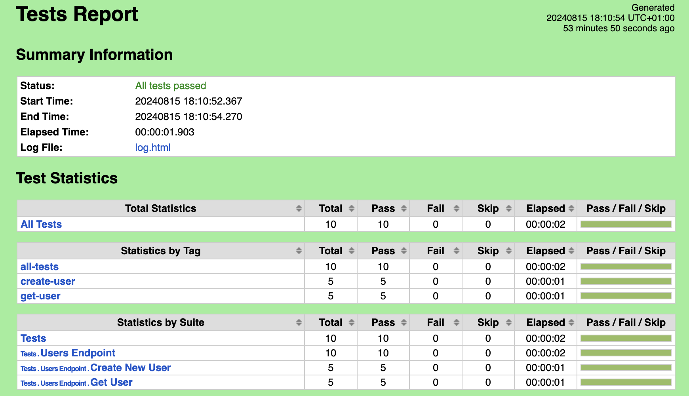
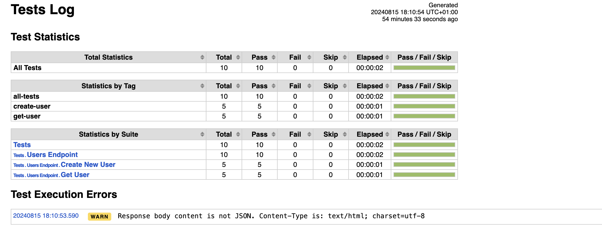
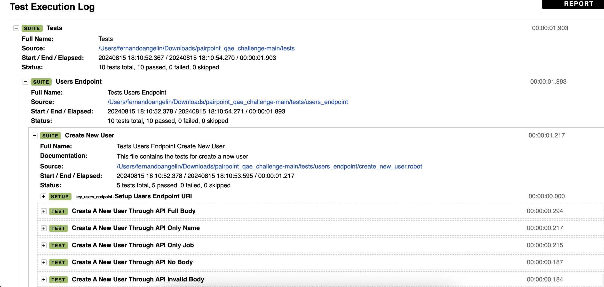
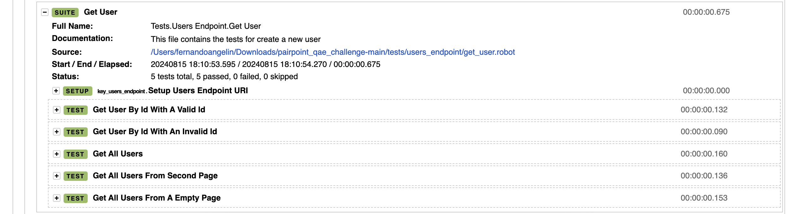

# pairpoint_qae_challenge
This repository contains a test automation suite for https://reqres.in/api API for /users endpoint. The chosen framework was Robot Framework.

## How to setup the project
To setup the project, one must have python installed (e.g. 3.12) and install the required libraries from the requirements.txt file, with the following command:

```shell
pip install -r requirements.txt
```

## How to run the tests
To run the all the tests in this project, one must run the following command:

```shell
robot -i all-tests tests
```

Where the -i includes all the tests with the tag all-tests inside tests folder.

If one wants to run only the create user tests, one must run the following command:

```shell
robot -i create-user tests
```

The same applies to the get user. One must run the following command:

```shell
robot -i get-user tests
```

## How to run it in parallel
This project was setup also to run the tests in parallel. To do it, one should run the following command:

```shell
pabot tests
```

Pabot creates workers to run each suite. For this specific case, two workers will be created to run the suite create_new_user and get_user. PS: it is installed in the previous step (while installing the libraries from the requirements.txt file)

## Run Evidence
One can find examples of Test Run Report and Test Run Log inside the evidence folder, [here](/evidence/). Please, download it and open in your local browser.

Below, one can see some screenshots:





